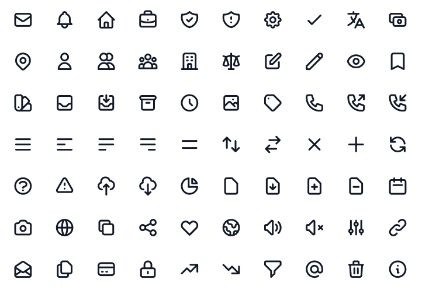

<p align="center">
    <a href="https://github.com/wireui/heroicons/">
        
    </a>
    <a href="https://github.com/wireui/heroicons/blob/main/LICENSE">
        
    </a>
    <a href="https://twitter.com/ph7jack">
        </a>
    </a>
</p>

# WireUi Heroicons

[](https://github.com/wireui/heroicons/actions/workflows/tests.yml)

#### _The Tailwind Heroicons for laravel blade by WireUI_
### This package doesn't have any WireUI dependency
WireUI Heroicons is a library of icons components to empower your Laravel and Livewire application development.

Stop creating all icons components from scratch. Get all WireUI Heroicons for free.

### 🔥 Heroicons
A set of free MIT-licensed high-quality SVG icons for UI development made by [TailwindLabs].

See all [Heroicons]



### 📚 Get Started
#### Prerequisites:
* [Laravel 9.x](https://laravel.com)
* [PHP 8.1](https://www.php.net/releases/8.1/en.php)

#### Install
```bash
composer require wireui/heroicons
```

#### How to use it?
You can find a list of all icons and variants on the [Heroicons] website

**Available variants:**
- mini.solid
- solid
- outline

```blade
<x-icon name="user" />
<x-icon name="user" solid />
<x-icon name="user" solid mini />
<x-icon name="user" variant="solid" />
<x-icon class="w-5 h-5 text-teal-600" name="user" />

<x-heroicons::outline.user />
<x-heroicons::solid.user />
<x-heroicons::mini.solid.user class="w-5 h-5" />
```

#### Publish (Optional)
```bash
php artisan vendor:publish --tag="wireui.heroicons.config"
php artisan vendor:publish --tag="wireui.heroicons.views"
```

### 📣 Follow the author
Stay informed about WireUI, follow [@ph7jack] on Twitter.

There will you see all the latest news about features, ideas, discussions and more...

### 💡 Philosophy
WireUI Heroicons is always FREE to anyone who would like to use it.
You can use the Heroicons in your laravel project.

This project is created [PH7-Jack], and it is maintained by the author with the help of the community.

All contributions are welcome!


### 📝 License

MIT


[PH7-Jack]: <https://github.com/PH7-Jack>
[@ph7jack]: <https://twitter.com/ph7jack>
[TailwindLabs]: <https://github.com/tailwindlabs>
[Heroicons]:<https://heroicons.com>
